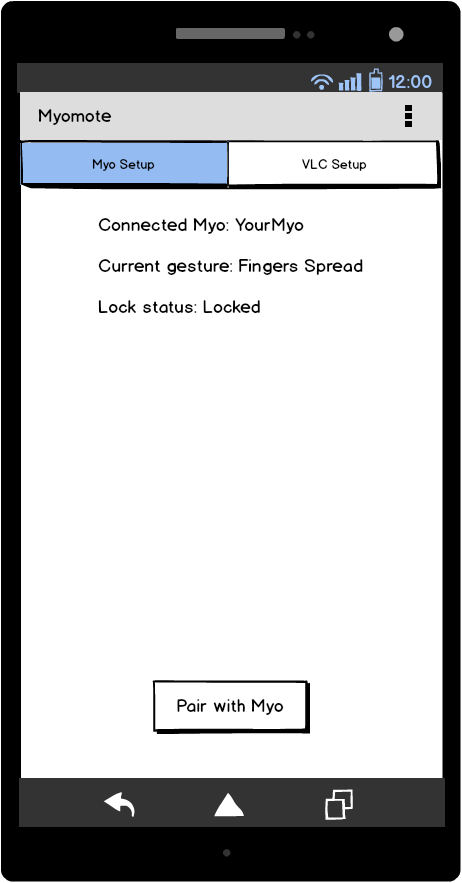
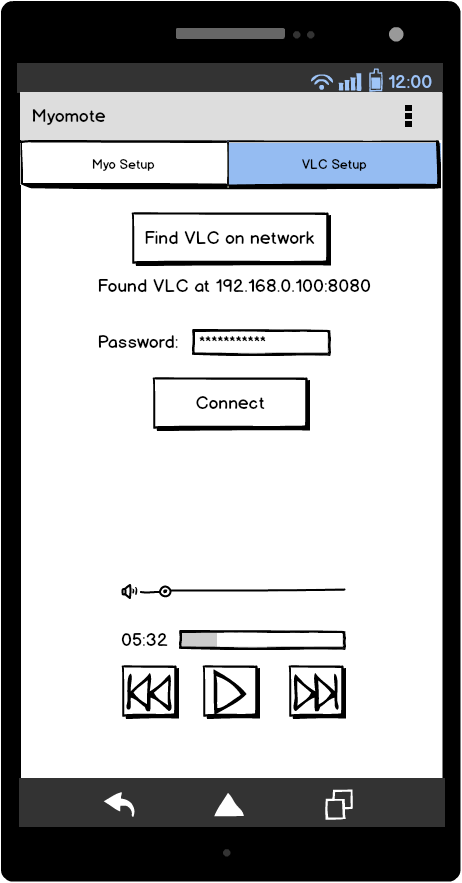
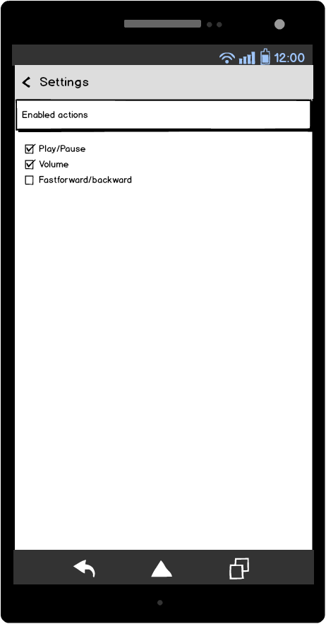

# Design Document
The app will contain a couple of views. One to setup the myo and show its
measurements and state to the user.

One to connect to the myo, this is provided by the SDK. This lists all the
Myos in the vicinity

One to setup the connection between the phone and VLC on the network. This page
will also contain some VLC controls and info about its state and currently
playing file. Because VLC uses a http api, the app will need a way to send [requests](https://developer.android.com/training/volley/simple.html)

The VLC and Myo setup views will be tabs on the opening screen of the app.

Finally there will be a settings view, where it is possible to disable/enable
certain features and controls.

### Mockups

### APIs and SDKs
- VLC: https://wiki.videolan.org/VLC_HTTP_requests/
- Myo: https://developer.thalmic.com/docs/api_reference/platform/the-sdk.html
